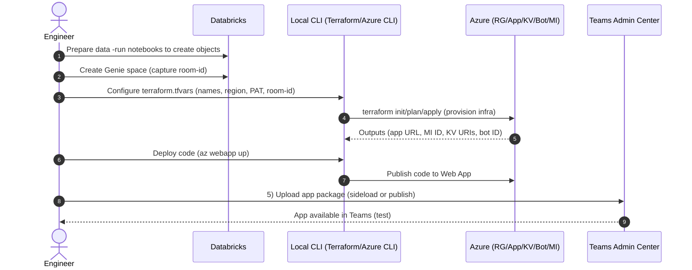
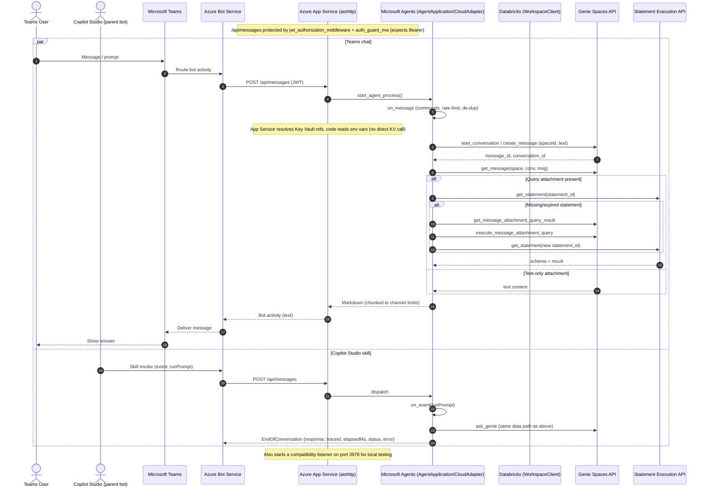

# Databricks Genie – M365 Agents


<!-- badges: start -->
[](LICENSE)


<!-- badges: end -->

> Bring **Databricks Genie**—natural‑language analytics over your Databricks datasets—directly into **Microsoft 365** via **Teams** and **Copilot Studio**. Turn everyday chat into governed data exploration, without moving users out of their flow.

---

## 🎯 Solution at a glance

This solution **surfaces Databricks Genie inside Microsoft Teams** and optionally exposes it in **Copilot Studio** as a **skill**. Genie lets people ask **natural‑language questions** over tabular data and returns **interpretable answers** (with optional SQL). By meeting users in **Teams**, adoption increases while access stays **RBAC‑aligned** through Microsoft Entra and Unity Catalog.

**Why this is useful**

- ✅ **Familiar UX:** a Teams chat surface business users already know.
- 🔌 **Copilot Studio integration:** enable **bot‑to‑bot handoff**.
  - *Simple skill:* send a free‑form prompt to Genie and return a single text result.
  - *Advanced skill:* return **5 structured outputs** (`elapsedMs`, `error`, `response`, `status`, `traceId`) for robust flow branching and logging.
- 🔐 **Enterprise auth:** **Service principal + OAuth** for Databricks (no runtime PATs).
- 🧰 **Repeatable infra:** **Terraform IaC** provisions and configures the Azure footprint.

**Author**  
Copyright (c) 2025 **Arnold Souza**  
Contact: <arnoldporto@gmail.com> · <https://www.linkedin.com/in/arnoldsouza/>

> Built as a contribution on top of the work by **Luiz Carrossoni** and **Ryan Bates** (see upstream [reference](https://github.com/carrossoni/DatabricksGenieBOT/tree/main)).

---

## 🧩 What’s new vs. upstream

- Framework modernization: Migrated from **Azure Bot Framework SDK** → **Microsoft 365 Agents SDK**.
- Secure Databricks access: **Service principal + OAuth** to access Databricks (replaces runtime PATs).
- Infrastructure as Code (IaC) coverage using **Terraform** to deploy and configure all **Azure** resources.
- **UX/engine upgrades:**
  - Refreshed welcome experience, in-app help menu, and configuration menu with adjustable defaults.
  - **Conversation reset** capability and application versioning support.
  - **Rich table** responses that include SQL snippets while limiting large result sets.
  - Commands to list/switch **Genie spaces** and **conversations**.

> **References:**  
> • Databricks Genie overview and setup (official docs) — see [reference](https://learn.microsoft.com/azure/databricks/genie/set-up)  
> • Microsoft 365 Agents SDK docs — see [reference](https://github.com/Microsoft/Agents-for-python)

---

## 🚀 Quick start

> ⚠️ Attention: This procedure is not compatible with Windows, only Unix OS (mac OS/Linux/WSL - Windows Subsystem for Linux)

1) **Prepare Databricks**
   - Create or choose a catalog/schema/volume and ingest your sample tables.  
   - Create a **Genie space** and capture its **`room-id`** (from the URL).  
   - Details: [Databricks pre‑deploy](docs/databricks-predeploy.md)

2) **Provision Azure (Terraform)**
    Execute the CLI:
    ```bash
    cd genie-M365-agent/infra
    cp terraform.tfvars.example.ini terraform.tfvars
    # fill in placeholders: Databricks PAT, Genie room-id, names, region
    terraform init && terraform validate
    terraform plan -out plan.tfplan
    terraform apply "plan.tfplan"
    ```
   - Details: [Azure automated deployment](docs/azure-deployment.md)

3) **Run locally (optional) & deploy app**
   - Create environment:
      ```bash
      cd genie-M365-agent
      python3.13 -m venv venv
      source venv/bin/activate
      pip install -r requirements.txt
      ```
   - Deploy to Azure Web App: Replace placeholders with your values, then run the code below in your CLI.

      ```bash
      az login
      az webapp up \
          --resource-group "<rg>" \
          --plan "<app-service-plan>" \
          --name "<webapp-name>" \
          --location "<region>" \
          --sku F1 \
          --runtime "PYTHON:3.13".
      ```
    - Details: For more info about local dev, check [Environment & run](docs/environment-setup.md##-Create-environment-and-install-dependencies)
4) **Publish the Teams app package**
   - Use the app package produced by Terraform or rebuild yours; sideload or publish in your tenant.  
   - Details: [Teams publish](docs/teams-zip-deployment.md)

5) **(Optional) Wire as a Copilot Studio skill**
   - Add a custom skill pointing to your bot endpoint and configure OAuth.  
   - Details: [Copilot skill](docs/copilot-skill.md)

### General Overview of the steps


---

## 📚 Documentation index

- [1. Prepare Databricks (Data + Genie space)](docs/databricks-predeploy.md)
- [2. Azure automated deployment (Terraform)](docs/azure-deployment.md)
  - [Optional - Manual Azure deployment](docs/manual-deployment.md)
- [4. Local environment & development](docs/environment-setup.md)
- [5. Publish to Microsoft Teams](docs/teams-zip-deployment.md)
- [6. Optional - Expose Genie as a Copilot Studio skill](docs/copilot-skill.md)
- [References (official docs)](docs/REFERENCES.md)

---

## 🤓 Technical deep-dive

Read the full article about **🏗️ Architecture**, **🔄 Runtime message flow**, and **👨‍💻Detailed bot engineering**  here: [Info for Nerds — Architecture & Engineering Deep-Dive](docs/info-for-nerds.md)

---

## 🏗️ Architecture

The cloud resources the solution interact, automated by terraform:

```mermaid
flowchart TB
  subgraph Azure
    RG[(Resource Group)]
    ASP[App Service Plan]
    MI[Managed Identity]
    BOT[Arure Bot]
    MFS[public/manifest.json]
    KV[Key Vault]
    APP[Web App]
  end

  subgraph Databricks[Azure Databricks]
    DSP[(Service Principal)]
    UC[Unity Catalog]
    CT[Catalog]
    SC[Database]
    TB[Tables]
    VL[Volumes]
    SPC[Genie Space]
    WH[SQL Warehouse]
  end

  subgraph Teams
    APPK[App Package]
    CHAT[Chatbot]
  end

  subgraph Copilot[Copilot Studio]
    SKI[Skill]
    TOP[Topic/Tool]
    Chatt[Chatbot]
  end

  IaC[[Terraform]] --> |Creates| RG
  RG --> |Host| ASP
  ASP --> |Link| APP
  BOT --> |Expose| MFS
  APP <--> |Uses| MI <--> |Access| KV
  APP --> |Linked| BOT

  IaC --> |Creates| DSP
  DSP --> |Access| UC
  UC --> |Use Catalog| CT
  CT --> |Use Schema |SC
  SC --> |Select |TB
  SC --> |Read Volume|VL
  DSP --> |Can Run| SPC
  DSP --> |Can Use| WH

  APPK --> CHAT

  MFS --> SKI
  SKI --> TOP
  TOP --> Chatt
  Chatt -->|Teams Channel| CHAT

  BOT -->|Distribute| APPK

  ```

---

## 🔄 Runtime message flow (who talks to whom)

```mermaid
sequenceDiagram
    autonumber
    actor U as Teams User
    actor Parent as Copilot Studio
    participant Teams as Microsoft Teams
    participant BotSvc as Azure Bot Service
    participant WebApp as Web App (Bot)
    participant DBX as Databricks
    participant Genie as Genie Space

    par Teams chat
        U->>Teams: Message
        Teams->>BotSvc: Route activity
        BotSvc->>WebApp: POST /api/messages
        WebApp->>DBX: Send prompt to Genie
        DBX->>Genie: Execute request
        Genie-->>DBX: Answer/result
        DBX-->>WebApp: Response payload
        WebApp-->>BotSvc: Reply activity
        BotSvc-->>Teams: Deliver message
        Teams-->>U: Show answer
    and Copilot Studio skill
        Parent->>BotSvc: Invoke (runPrompt)
        BotSvc->>WebApp: POST /api/messages
        WebApp->>DBX: Send prompt to Genie
        DBX->>Genie: Execute request
        Genie-->>DBX: Answer/result
        DBX-->>WebApp: Response payload
        WebApp-->>BotSvc: EndOfConversation {response}
        BotSvc-->>Parent: Return response
    end
```

---

## Detailed bot engineering



---

## 🖼️ Feature gallery (placeholders)

Save screenshots to **`docs/images/`** with these names.

| Feature | Screenshot | GIF (optional) |
|---|---|---|
| Welcome & Help menus |  |  |
| Config & Reset |  |  |
| Genie Q&A in Teams |  |  |
| Smart tables (SQL + truncate) |  |  |
| List & switch Spaces |  |  |
| List & switch conversations |  |  |
| Copilot Advanced Skill (5 outputs) |  |  |
| Terraform apply (Azure) |  |  |

> Tip: Prefer 1280×720 (or similar) for consistent display.

---

## ✅ Compatibility matrix

| Component | Version | CLI |
|---|---|---|
| Python | **3.13.7** | `python3.13` |
| Terraform | **1.13.3** | `terraform` |
| Azure CLI | **2.77.0** | `az` |
| Agents Playground | **0.2.18** | `agentsplayground` |
| Dev Tunnels | **1.0.1435** | `devtunnel` |
| Cloud | **Azure** | — |

ℹ️ Pin versions for reproducibility. Runtime libraries are pinned in `genie-M365-agent/requirements.txt`.  
⚠️ IaC/CLI steps assume **macOS, Linux, or WSL** (pure Windows not supported).

---

## 🔐 Security & secrets

- **Never commit secrets**: prefer Key Vault, environment variables, and secure CI stores.
- Restrict Key Vault with **managed identity** and rotate credentials regularly.
- Enforce **RBAC** with Microsoft Entra groups consistently across Azure, Databricks, and Copilot Studio.
- Databricks access uses **OAuth client credentials** with a **service principal**.
- For Terraform bootstrap, a **Databricks PAT** may be required. Keep it **only** in `terraform.tfvars` (or in CI secrets).

> ⚠️ Terraform may generate `genie-M365-agent/infra/secrets/`. **Never commit** this folder.

---

## 🙌 Acknowledgements & license

- Original authors: **Luiz Carrossoni** and **Ryan Bates** — upstream reference in `docs/REFERENCES.md`  
- This contribution: **Arnold Souza**

**License:** MIT — see `LICENSE`

---

## 📽️ Images & GIFs – placeholders

> Put your media files under `docs/images/` (PNG) and `docs/gifs/` (GIF). Keep GIFs short (≤20s), 1280×720 if possible.

### Recommended naming (you can keep these or rename)
- `docs/images/hero-readme.png` — README hero banner
- `docs/gifs/feature-01-welcome-help.gif` — Welcome/Help interaction
- `docs/gifs/feature-02-config-reset.gif` — Config & reset
- `docs/gifs/feature-03-genie-qa-teams.gif` — Q&A in Teams
- `docs/gifs/feature-04-smart-tables.gif` — Smart tables with SQL
- `docs/gifs/feature-05-switch-spaces.gif` — List/switch spaces
- `docs/gifs/feature-06-switch-conversations.gif` — List/switch conversations
- `docs/gifs/feature-07-copilot-advanced-skill.gif` — Copilot skill call
- `docs/gifs/feature-08-terraform-apply.gif` — Terraform flow

**Pro tips**
- Prefer 1280×720 or 1440×900.
- Keep GIFs ≤ 10–20s and < 8MB (optimize with tools of your choice).
- Use descriptive alt text (e.g., “GIF – Switch spaces in Teams”).
