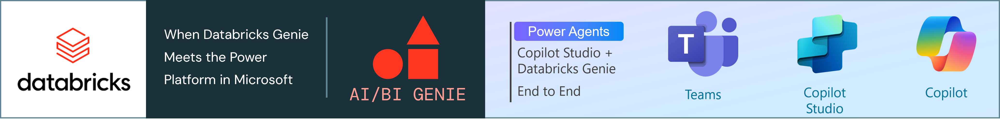
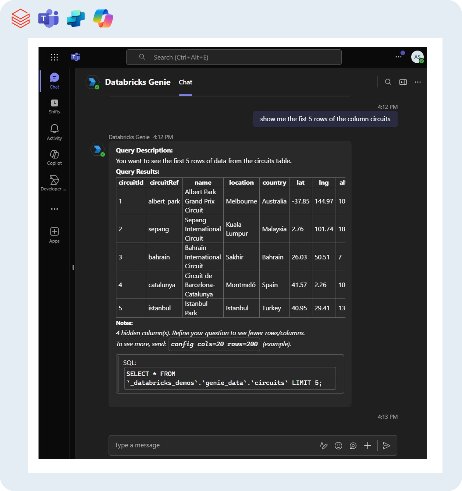
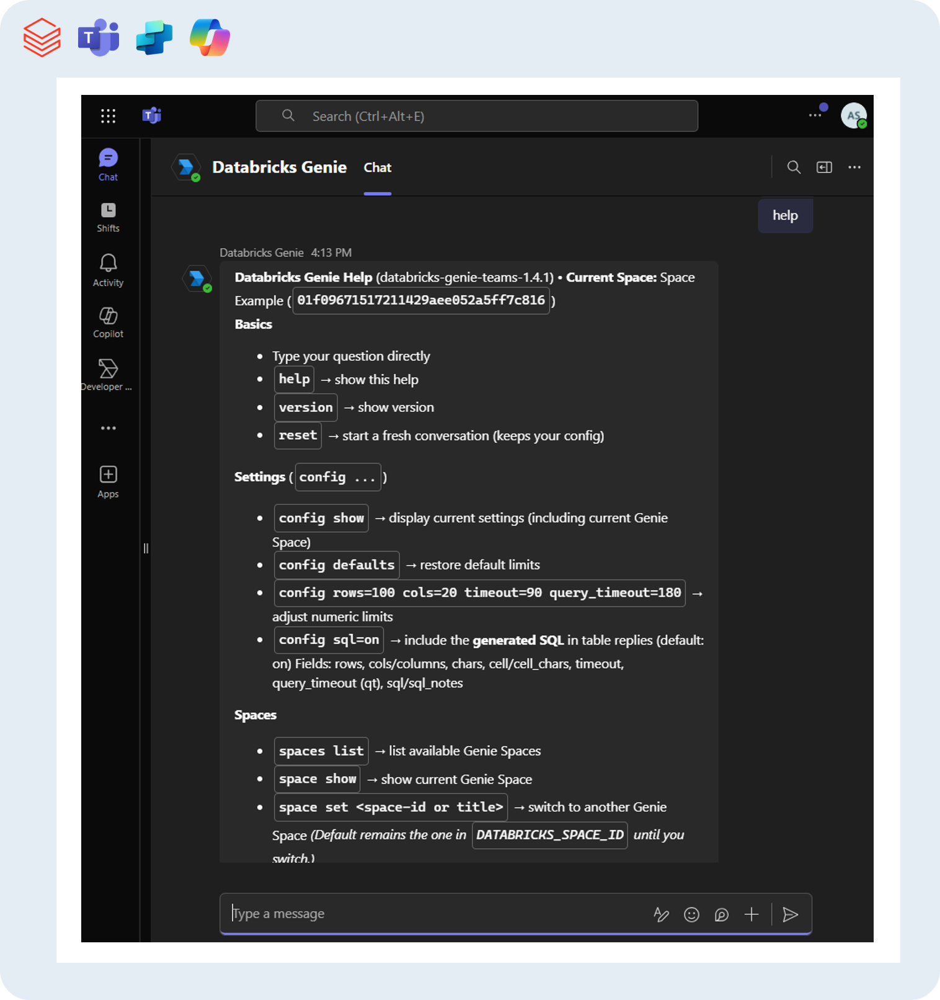
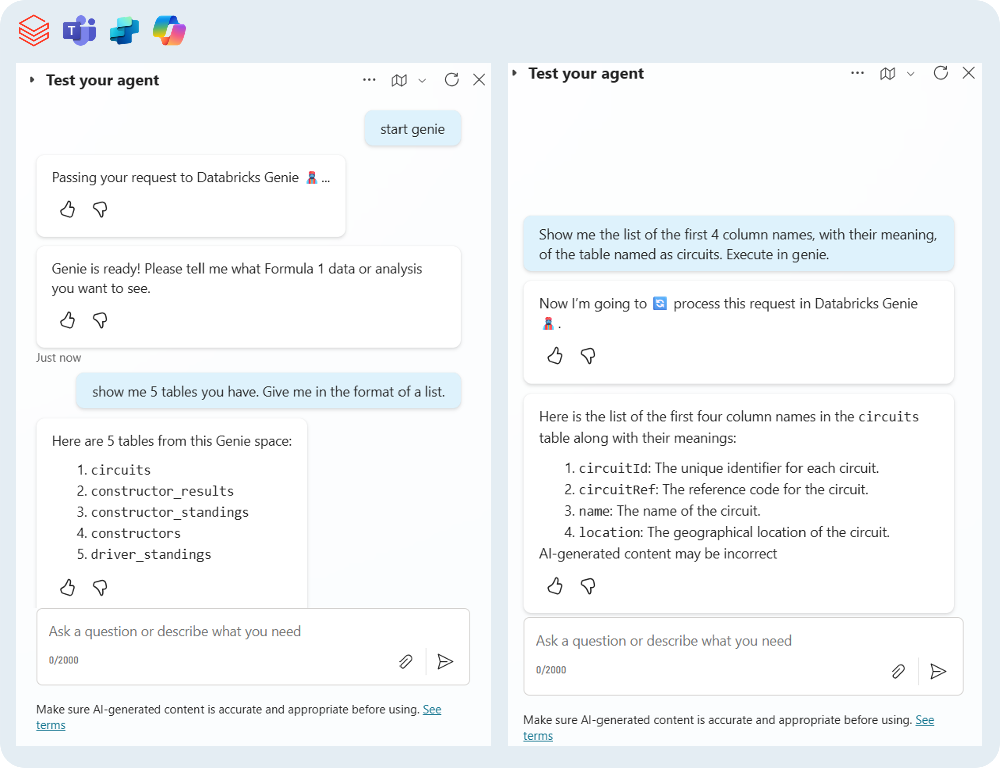
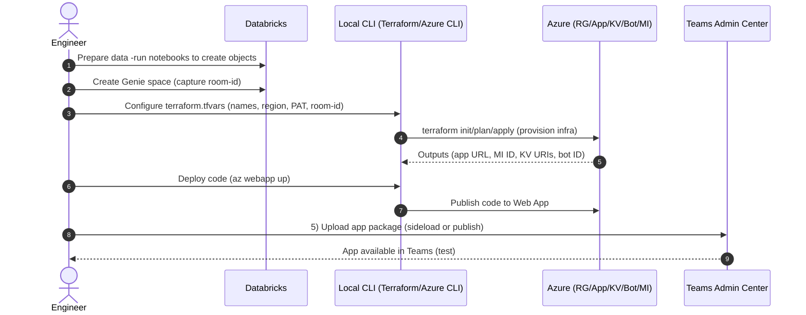

# Databricks Genie – M365 Agents



<!-- badges: start -->
[](LICENSE)


<!-- badges: end -->

> Bring **Databricks Genie**—natural‑language analytics over your Databricks datasets—directly into **Microsoft 365** via **Teams** and **Copilot Studio**. Turn everyday chat into governed data exploration, without moving users out of their flow.

## Solution at a glance

This solution **surfaces Databricks Genie inside Microsoft Teams** and optionally exposes it in **Copilot Studio** as a **skill**. Genie lets people ask **natural‑language questions** over tabular data and returns **interpretable answers** (with optional SQL). By meeting users in **Teams**, adoption increases while access stays **RBAC‑aligned** through Microsoft Entra and Unity Catalog.

MS Teams - Welcome message:


MS Teams - Querying tabular data:


MS Teams - Help menu:


MS Copilot Studio - Consuming Genie as a Skill:


**Why this is useful**

- **Familiar UX:** a Teams chat surface business users already know.
- **Copilot Studio integration:** enable **bot‑to‑bot handoff**.
  - *Simple skill:* send a free‑form prompt to Genie and return a single text result.
  - *Advanced skill:* return **5 structured outputs** (`elapsedMs`, `error`, `response`, `status`, `traceId`) for robust flow branching and logging.
- **Enterprise auth:** **Service principal + OAuth** for Databricks (no runtime PATs).
- **Repeatable infra:** **Terraform IaC** provisions and configures the Azure footprint.

**Author**  
Copyright (c) 2025 **Arnold Souza**  
Contact: <arnoldporto@gmail.com> · <https://www.linkedin.com/in/arnoldsouza/>

> Built as a contribution on top of the work by **Luiz Carrossoni** and **Ryan Bates** (see upstream [here](https://github.com/carrossoni/DatabricksGenieBOT/tree/main) and [here](https://medium.com/@ryan-bates/microsoft-teams-meets-databricks-genie-api-a-complete-setup-guide-81f629ace634)).

## What’s new vs. upstream

- Framework modernization: Migrated from **Azure Bot Framework SDK** → **Microsoft 365 Agents SDK**.
- Secure Databricks access: **Service principal + OAuth** to access Databricks (replaces runtime PATs).
- Infrastructure as Code (IaC) coverage using **Terraform** to deploy and configure all **Azure** resources.
- **UX/engine upgrades:**
  - Refreshed welcome experience, in-app help menu, and configuration menu with adjustable defaults.
  - **Conversation reset** capability and application versioning support.
  - **Rich table** responses that include SQL snippets while limiting large result sets.
  - Commands to list/switch **Genie spaces** and **conversations**.

> **References:**  
> • Databricks Genie overview and setup (official docs) — see [reference](https://learn.microsoft.com/azure/databricks/genie/set-up)  
> • Microsoft 365 Agents SDK docs — see [reference](https://github.com/Microsoft/Agents-for-python)

## Quick start path

> ⚠️ Attention: This procedure is not compatible with Windows, only with Unix OS (mac OS/Linux/WSL - Windows Subsystem for Linux)

1) **Prepare Databricks**
   - Create or choose a catalog/schema/volume and ingest your sample tables.  
   - Create a **Genie space** and capture its **`room-id`** (from the URL).  
   - Details: [Databricks pre‑deploy](docs/databricks-predeploy.md)

2) **Provision Azure (Terraform)**
    Execute the CLI:
    ```bash
    cd genie-M365-agent/infra
    cp terraform.tfvars.example.ini terraform.tfvars
    # fill in placeholders: Databricks PAT, Genie room-id, names, region
    terraform init && terraform validate
    terraform plan -out plan.tfplan
    terraform apply "plan.tfplan"
    ```
   - Details: [Azure automated deployment](docs/azure-deployment.md)

3) **Create environment & deploy app**
   - Create environment:
      ```bash
      cd genie-M365-agent
      python3.13 -m venv venv
      source venv/bin/activate
      pip install -r requirements.txt
      ```
   - Deploy to Azure Web App: Replace placeholders with your values, then run the code below in your CLI.

      ```bash
      az login
      az webapp up \
          --resource-group "<rg>" \
          --plan "<app-service-plan>" \
          --name "<webapp-name>" \
          --location "<region>" \
          --sku F1 \
          --runtime "PYTHON:3.13".
      ```
    - Details: For more info about local test/development, check [Run the bot locally](docs/environment-setup.md#run-the-bot-locally)
4) **Publish the Teams app package**
   - Use the app package produced by Terraform or rebuild yours present in your project in this path: `genie-M365-agent/ms_teams/app_package/dbx-genie-m365-app.zip`
   - Sideload or publish in your teams tenant.  
   - Details: [Teams publish](docs/teams-zip-deployment.md)

5) **(Optional) Wire as a Copilot Studio skill**
   - Add a custom skill pointing to your bot endpoint and configure OAuth.  
   - Details: [Copilot skill](docs/copilot-skill.md)

### General Overview of the Quick start path


## Documentation index

- [1. Prepare Databricks (Data + Genie space)](docs/databricks-predeploy.md)
- [2. Azure automated deployment (Terraform)](docs/azure-deployment.md)
  - [Optional - Manual Azure deployment](docs/manual-deployment.md)
- [4. Local environment & development](docs/environment-setup.md)
- [5. Publish to Microsoft Teams](docs/teams-zip-deployment.md)
- [6. Optional - Expose Genie as a Copilot Studio skill](docs/copilot-skill.md)
- [Info for Nerds — Architecture & Engineering Deep-Dive](docs/info-for-nerds.md)

## Technical deep-dive

Read the full article about:
  - **Architecture**
  - **Runtime message flow**
  - **Detailed bot engineering**

You can access detailed information here: 
  - [Info for Nerds — Architecture & Engineering Deep-Dive](docs/info-for-nerds.md)

## Compatibility matrix

| Component | Version | CLI |
|---|---|---|
| Python | **3.13.7** | `python3.13` |
| Terraform | **1.13.3** | `terraform` |
| Azure CLI | **2.77.0** | `az` |
| Agents Playground | **0.2.18** | `agentsplayground` |
| Dev Tunnels | **1.0.1435** | `devtunnel` |
| Cloud | **Azure** | — |

ℹ️ Pin versions for reproducibility. Runtime libraries are pinned in `genie-M365-agent/requirements.txt`.  
⚠️ IaC/CLI steps assume **macOS, Linux, or WSL** (pure Windows not supported).

## Security & secrets

- **Never commit secrets**: prefer Key Vault, environment variables, and secure CI stores.
- Restrict Key Vault with **managed identity** and rotate credentials regularly.
- Enforce **RBAC** with Microsoft Entra groups consistently across Azure, Databricks, and Copilot Studio.
- Databricks access uses **OAuth client credentials** with a **service principal**.
- For Terraform bootstrap, a **Databricks PAT** may be required. Keep it **only** in `terraform.tfvars` (or in CI secrets).

> ⚠️ Terraform may generate `genie-M365-agent/infra/secrets/`. **Never commit** this folder.

### Security known TODOs

Future known implementations that can elevate the project. 

#### 1) Allow-list skill callers by App ID
- **Goal:** Only trusted Copilot/bots can invoke Genie as a Skill.
- **Action:** Add middleware after JWT validation to check `azp/appid` against `ALLOWED_CALLER_APP_IDS`.
- **Config:** `ALLOWED_CALLER_APP_IDS="<appId1>,<appId2>"`
- **Done when:** Allowed callers work; unknown callers get **403** (`reason=caller_not_allowed`).

#### 2) Per-user auth via On-Behalf-Of (OBO)
- **Goal:** Enforce 1:1 user data access across Teams, Copilot Studio, and Databricks.
- **Action:** Use MSAL `acquire_token_on_behalf_of` with the user token; pass the resulting token to Databricks/SQL Warehouse.
- **Config:** `AAD_TENANT_ID`, `AAD_CLIENT_ID`, `AAD_CLIENT_SECRET` (or cert), `OBO_SCOPES_DBX`.
- **Done when:** Users only see data they’re entitled to in Unity Catalog; non-entitled users receive a clear auth error.


## Disclaimer

> [!IMPORTANT]
> This project implements an **experimental** chatbot that interacts with Databricks’ **Genie API**, which is **currently in Private Preview** and **not officially supported**. Interfaces, behaviors, and availability may change or break without notice. There is **no official support** from Databricks or Microsoft for this integration.

> [!WARNING]
> **Do not use in production** without your own security, compliance, and data-governance reviews. You are responsible for protecting credentials, secrets, and any data accessed through this bot.

> [!NOTE]
> This notice will be updated if the Genie API’s support/preview status changes.

**Scope:** The bot is designed to facilitate conversations with Genie—Databricks’ AI assistant—through chat interfaces such as **Microsoft Teams** (and optionally **Copilot Studio**).

**Affiliation:** This repository is **community-driven** and **not affiliated with or endorsed by Databricks or Microsoft**.

**License:** Provided “as is” under the **MIT License**. See `LICENSE` for details.
