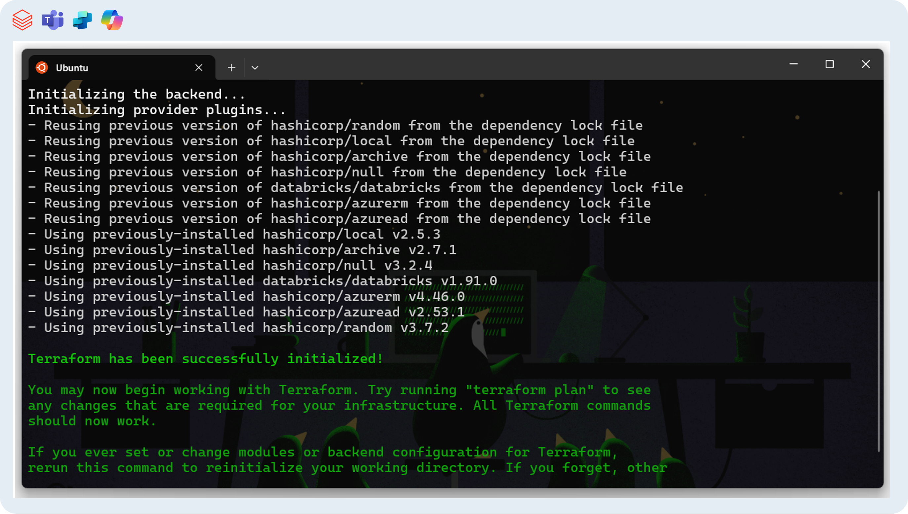

# Azure automated deployment (Terraform)

Provision the Azure footprint for the bot using **Terraform**.

## Prerequisites
- Azure permissions to create resource groups, service principals, managed identities, Key Vault, App Service, and Azure Bot.
- Access to a Databricks workspace with privileges to create catalog/schema/volume/tables.
- A Databricks **Personal Access Token (PAT)** for bootstrap (Workspace Admin + edit on the target catalog/schema). Store it only in `terraform.tfvars` or CI secrets.
- Terraform v1.13.3
- Azure CLI 2.77.0 authenticated (`az login`)
- Python 3.13.7.

> ⚠️ Attention: This procedure is not compatible with Windows, only with Unix OS (mac OS/Linux/WSL - Windows Subsystem for Linux)

## Steps

Move to `infra` folder, change values in `terraform.tfvars`, execute terraform project.

The `terraform.tfvars` file should have the values mentioned in [this section](#details-about-terraform-variables-input).

Once variables are filled, then execute the CLI:
```bash
cd genie-M365-agent/infra
cp terraform.tfvars.example.ini terraform.tfvars
# Fill in values: names, region, PAT, Genie room-id, etc.
terraform init
terraform validate
terraform plan -out plan.tfplan
terraform apply "plan.tfplan"
```




**Outputs** include app URL, managed identity IDs, Key Vault URIs, and bot IDs. Save them for later steps.

> ⚠️ Attention: The terraform generates the folder `genie-M365-agent\infra\secrets`. Never commit this folder. The content is to help user to get acces to sensitive info after deployment. 

## Terraform Technical Information
### Details about Terraform Variables (input)


| Type     | Variable                   | Value Pattern / Example                                                                 | Description / Details                                                                 |
|----------|----------------------------|-----------------------------------------------------------------------------------------|---------------------------------------------------------------------------------------|
| string   | `subscription_id`          | `"12345678-abcd-1234-efgh-9876543210aa"`                                                | Azure subscription GUID where resources will be deployed.                             |
| string   | `project_name`             | `"genie-m365"`                                                                          | Project short name; used as prefix for resource naming conventions.                   |
| string   | `environment`              | `"tst"` or `"dev"`, `"prd"`                                                             | Environment indicator (test, development, production).                                |
| string   | `location`                 | `"brazilsouth"`                                                                         | Azure region where resources will be deployed.                                        |
| string   | `sku_name`                 | `"F1"`                                                                                  | SKU for the App Service Plan (e.g., F1 = Free tier, B1 = Basic).                      |
| string   | `bot_sku`                  | `"F0"`                                                                                  | SKU for the Azure Bot Service (e.g., F0 = Free tier, S1 = Standard).                  |
| map      | `tags`                     | `{ owner = "john.doe@company.com", product = "Databricks Genie M365" }`                 | Key/value tags applied to all Azure resources for governance and cost tracking.       |
| string   | `azuread_app_display_name` | `"genie-m365-app"`                                                                      | Display name of the Azure AD app registration (App Registration in Entra ID).         |
| string   | `bot_display_name`         | `"Genie Chatbot M365"`                                                                  | Friendly display name for the Azure Bot resource.                                     |
| string   | `databricks_host`          | `"https://adb-123456789012345.9.azuredatabricks.net"`                                   | Base URL of the Databricks workspace.                                                 |
| string   | `databricks_token`         | `"dapid1234567890abcdef1234567890abcdef"`                                               | **Sensitive**: Databricks Personal Access Token (PAT). Used only for Terraform.       |
| string   | `databricks_space_id`      | `"01f09671517211429aee052a5ff7c816"`                                                    | Genie Space ID (from Item 5 of [Databricks pre‑deploy](databricks-predeploy.md) step).                          |
| string   | `databricks_sql_warehouse_id` | `"6a3f431e969b35e9"`                                                                  | ID of the SQL Warehouse associated with the Genie Space.                              |
| string   | `databricks_catalog_name`  | `"_databricks_demos"`                                                                   | Target catalog in Unity Catalog where Genie data lives.                               |
| string   | `databricks_schema_name`   | `"genie_data"`                                                                          | Target schema in Unity Catalog where Genie data lives.                                |
| list     | `databricks_oauth_scopes`  | `["all-apis", "sql", "offline_access"]`                                                 | OAuth scopes granted to the Databricks service principal. Leave this as default value.  |

### Inventory — Resources, Permissions, and Objects (Generated from TF)

#### Azure Resource Manager
| Type | Name (TF) | Purpose / Notes |
|---|---|---|
| `azurerm_resource_group` | `rg` | Resource container for all Azure assets. |
| `azurerm_service_plan` | `asp` | Linux App Service Plan (SKU `var.sku_name`). |
| `azurerm_linux_web_app` | `webapp` | Python 3.13 App Service; Bot endpoint `/api/messages`; **SystemAssigned** identity; merges KV-backed App Settings. |
| `azurerm_bot_service_azure_bot` | `bot` | Registers the Bot in Azure Bot Service; endpoint points to App Service. |
| `azurerm_bot_channel_ms_teams` | `bot_teams` | Enables Teams channel for the bot. |
| `azurerm_key_vault` | `kv` | Stores secrets; soft delete enabled; RBAC mode; public network allowed (adjust as needed). |
| `azurerm_role_assignment` | `kv_officer_current` | Grants **Key Vault Secrets Officer** to current principal to write secrets. |
| `azurerm_role_assignment` | `kv_webapp_user` | Grants **Key Vault Secrets User** to **Web App Managed Identity** for runtime secret resolution. |

#### Azure AD (Microsoft Entra ID)
| Type | Name (TF) | Purpose / Notes |
|---|---|---|
| `azuread_application` | `bot_app` | App Registration (single-tenant) for the Bot. |
| `azuread_service_principal` | `bot_sp` | SP for the App Registration. |
| `azuread_application_owner` | `me_app_owner` | Sets the current caller as **OWNER** of the App Registration. |
| `azuread_application_password` | `bot_secret` | Bot **client secret** (2-year lifetime). |

#### Key Vault Secrets (values originate from variables & created objects)
| Secret Name | Source |
|---|---|
| `svc-conn-clientid` | `var.azuread_app_display_name` App’s Client ID (bot). |
| `svc-conn-clientsecret` | `azuread_application_password.bot_secret.value`. |
| `svc-conn-tenantid` | `data.azurerm_client_config.current.tenant_id`. |
| `databricks-space-id` | `var.databricks_space_id`. |
| `databricks-host` | `var.databricks_host`. |
| `databricks-sp-client-id` | `databricks_service_principal.genie.application_id`. |
| `databricks-sp-client-secret` | `databricks_service_principal_secret.genie_oauth.secret`. |
| `databricks-token` | **Terraform PAT** (`var.databricks_token`) – used by TF only. |

> App Settings map to Key Vault secrets via `@Microsoft.KeyVault(SecretUri=...)` (see `appsettings_kv.tf`), populating: `CONNECTIONS__SERVICE_CONNECTION__SETTINGS__*`, `DATABRICKS_*`, and `DATABRICKS_OAUTH_SCOPES`.

#### Databricks (Workspace)
| Type | Name (TF) | Purpose / Notes |
|---|---|---|
| `databricks_service_principal` | `genie` | SP used by the Web App at runtime (OAuth M2M). |
| `databricks_service_principal_secret` | `genie_oauth` | SP secret consumed by Web App (stored in KV). |
| `null_resource` | `grant_space_can_run` | **REST PATCH** to `/api/2.0/permissions/genie/{space}` to add **CAN_RUN** for the SP. |
| `databricks_permissions` | `warehouse_can_use` | (Conditional) Grants **CAN_USE** on `var.databricks_sql_warehouse_id`. |
| `databricks_grants` | `catalog` | Grants **USE_CATALOG** on `var.databricks_catalog_name`. |
| `databricks_grants` | `schema` | Grants **USE_SCHEMA, SELECT, EXECUTE, READ_VOLUME** on `catalog.schema`. |

#### Local Artifacts (created on your machine)
| Resource | Path | Notes |
|---|---|---|
| `local_file.bot_credentials` | `./secrets/bot_credentials.json` | AAD client credentials for bot (for tooling/emulator flows). |
| `local_file.genie_sp_credentials` | `./secrets/genie_m365_integration.json` | Databricks SP credentials (name, client_id, client_secret). |
| `local_file.skill_manifest` | `../public/manifest.json` | Bot Skill manifest (BF v2.2) pointing to your endpoint. |
| `local_file.teams_manifest` | `../ms_teams/assets/manifest.json` | Teams app manifest (uses random UUID). |
| `data.archive_file.assets_zip` | `../ms_teams/app_package/dbx-genie-m365-app.zip` | **Upload this** to Teams as a custom app. |
| `local_sensitive_file.project_env` | `../.env` | Consolidated environment (sensitive). |

### Conditional Behavior Summary
- Genie **CAN_RUN** is always attempted (requires PAT & space permissions).

