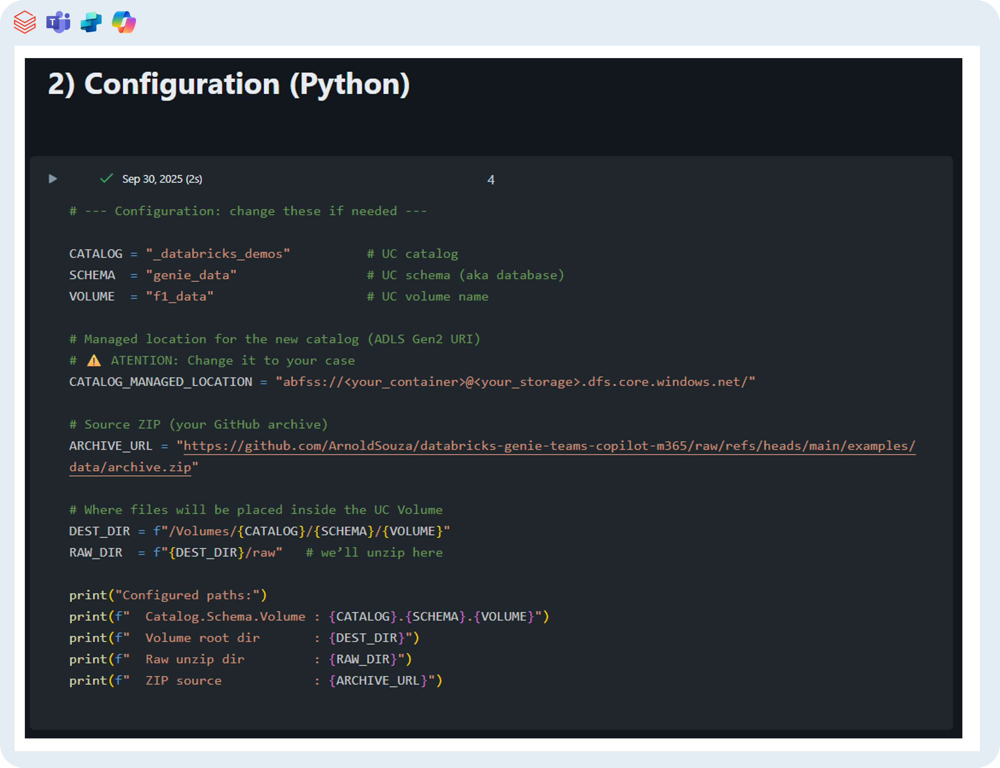
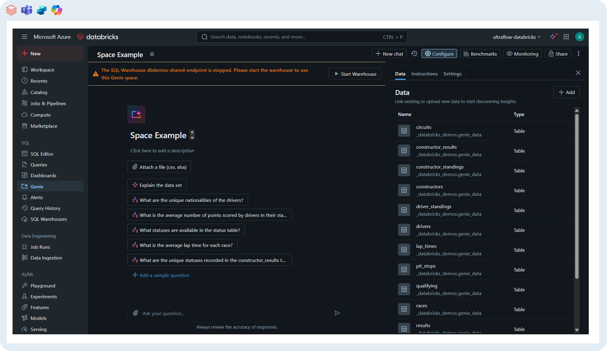

# Databricks pre‑deploy

> Goal: prepare data artifacts and capture a **Genie space `<room-id>`** for later use.

1. Import the notebook: `genie-M365-agent/examples/notebooks/Genie Spaces - F1 Dataset Ingestion & Delta Tables.ipynb` [(link)](../genie-M365-agent/examples/notebooks/Genie%20Spaces%20-%20F1%20Dataset%20Ingestion%20&%20Delta%20Tables.ipynb) to your databricks workspace.

   

2. Edit variables in cell 2 of the python notebook named as:

| Variable                  | Example Value                     | What it is / Purpose                                                                 |
|----------------------------|-----------------------------------|---------------------------------------------------------------------------------------|
| `CATALOG`                 | `"genie_demo"`                    | The Unity Catalog **catalog name** where your Genie data will be stored. Acts as the top-level container. |
| `SCHEMA`                  | `"finance_data"`                  | The **schema** (a.k.a. database) inside the catalog. Used to organize your tables.    |
| `VOLUME`                  | `"landing_zone"`                  | A **volume** inside the catalog/schema where raw files (.CSV) will be ingested. |
| `CATALOG_MANAGED_LOCATION`| `"abfss://genie-container@geniesa.blob.core.windows.net/"` | The **storage location URI** (ADLS Gen2 / Blob Storage) that backs the catalog. Must point to a valid container you own. |

3. Run the notebook (requires privileges to create catalog/schema/volume/tables).
4. Create a **Genie Space** via the [Databricks UI](https://learn.microsoft.com/en-us/azure/databricks/genie/set-up#-create-a-genie-space) and copy the **`room-id`** from the URL.

      

   - Generic URL: `https://adb-<workspace-id>.<region>.azuredatabricks.net/genie/rooms/<room-id>?o=<org-id>`
   - Example (fake): `https://adb-123456789012345.9.azuredatabricks.net/genie/rooms/0abc123def4567890fedcba987654321?o=123456789012345`
5. You’ll need this **`room-id`** (e.g. `0abc123def4567890fedcba987654321`) later in `infra/terraform.tfvars`.

**Official docs:**
- Databricks: *Set up and manage an AI/BI Genie space* — https://learn.microsoft.com/azure/databricks/genie/set-up
