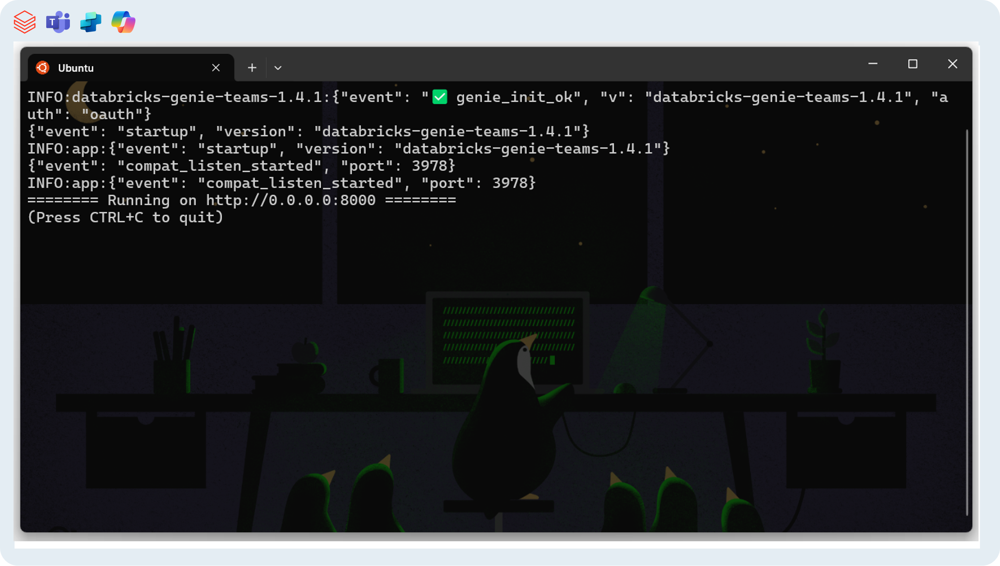
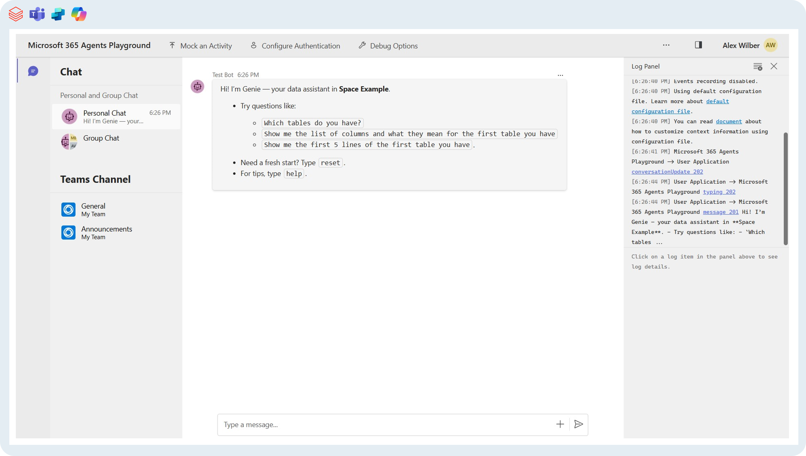
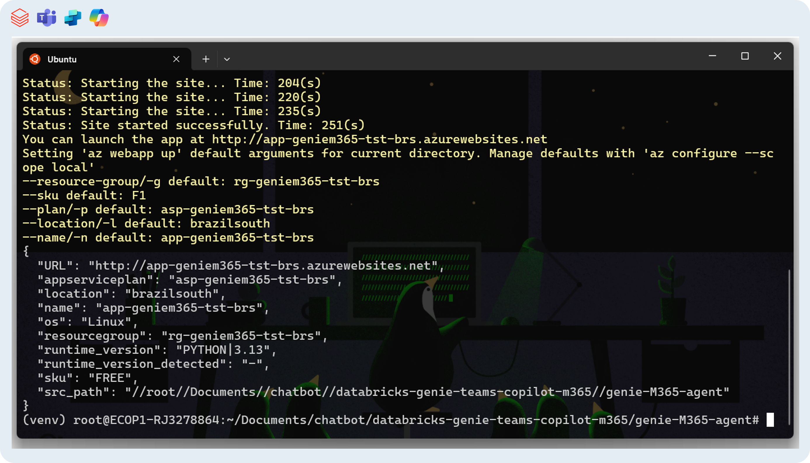

# Local environment & development

## Create environment and install dependencies
```bash
cd genie-M365-agent
python3.13 -m venv venv
source venv/bin/activate
pip install -r requirements.txt
```

## Run the bot locally

Run it in one CLI:
```bash
# start the aiohttp app (http://localhost:8000)
python3 -m aiohttp.web -H 0.0.0.0 -P 8000 src.main:create_app
```

Everything should be good if you see `✅ genie_init_ok` in the output. 

```
INFO:databricks-genie-teams-1.4.1:{"event": "✅ genie_init_ok", "v": "databricks-genie-teams-1.4.1", "auth": "oauth"}
```



### Option A — Test with Agents Playground

Using another CLI, run:
```bash
agentsplayground \
  --app-endpoint "http://localhost:3978/api/messages" \
  --channel-id "emulator" \
  --client-id "<CLIENT_ID>" \
  --client-secret "<CLIENT_SECRET>" \
  --tenant-id "<TENANT_ID>"
```
The Agents Playground is going to open a new tab with the Teams emulator. Now it's time to test/develop. 



### Option B — Expose locally with Dev Tunnels

Using another CLI, run:
```bash
devtunnel host -a -p 3978
```
- Update your **Bot** message endpoint to: `https://<your-dev-tunnel>/api/messages`
- Update your **App Registration** Home Page URL to: `https://<your-dev-tunnel>`
- **Revert** both to your production App Service URL before going live.

## Deploy application code to Azure (quick path)

If you already want to deploy the app to azure, then replace placeholders with your values and run it in the CLI:

```bash
az login
az webapp up \
    --resource-group "<rg>" \
    --plan "<app-service-plan>" \
    --name "<webapp-name>" \
    --location "<region>" \
    --sku F1 \
    --runtime "PYTHON:3.13"
```

The expected result is to have the message confirmation of the deployment, like the one below:




