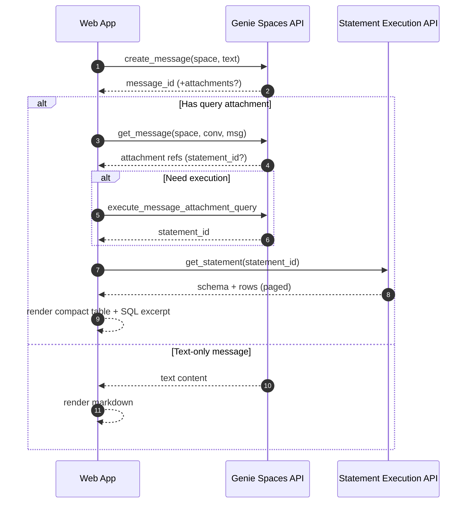

# Info for Nerds — Architecture & Engineering Deep‑Dive

---

## 🏗️ Architecture

### High‑level components
- **Azure:** Resource Group, Key Vault (RBAC), Linux App Service Plan, Web App (aiohttp Python bot, System‑assigned MI), Azure Bot Service (Teams channel).  
- **Databricks:** Service Principal (workspace), OAuth client secret, Genie Space (room), Unity Catalog grants (catalog/schema) and SQL Warehouse permission.  
- **Identity & secrets:**
  - Runtime uses OAuth client‑credentials with scopes (e.g., `all-apis`, `sql`, `offline_access`).  
  - Web App reads App Settings that are Key Vault references (`@Microsoft.KeyVault(SecretUri=...)`), resolved by the platform via Managed Identity.  

### Architecture diagram

The cloud resources the solution interact, automated by terraform:

```mermaid
flowchart TB
  subgraph Azure
    RG[(Resource Group)]
    ASP[App Service Plan]
    MI[Managed Identity]
    BOT[Arure Bot]
    MFS[public/manifest.json]
    KV[Key Vault]
    APP[Web App]
  end

  subgraph Databricks[Azure Databricks]
    DSP[(Service Principal)]
    UC[Unity Catalog]
    CT[Catalog]
    SC[Database]
    TB[Tables]
    VL[Volumes]
    SPC[Genie Space]
    WH[SQL Warehouse]
  end

  subgraph Teams
    APPK[App Package]
    CHAT[Chatbot]
  end

  subgraph Copilot[Copilot Studio]
    SKI[Skill]
    TOP[Topic/Tool]
    Chatt[Chatbot]
  end

  IaC[[Terraform]] --> |Creates| RG
  RG --> |Host| ASP
  ASP --> |Link| APP
  BOT --> |Expose| MFS
  APP <--> |Uses| MI <--> |Access| KV
  APP --> |Linked| BOT

  IaC --> |Creates| DSP
  DSP --> |Access| UC
  UC --> |Use Catalog| CT
  CT --> |Use Schema |SC
  SC --> |Select |TB
  SC --> |Read Volume|VL
  DSP --> |Can Run| SPC
  DSP --> |Can Use| WH

  APPK --> CHAT

  MFS --> SKI
  SKI --> TOP
  TOP --> Chatt
  Chatt -->|Teams Channel| CHAT

  BOT -->|Distribute| APPK

  ```

### Permissions & RBAC matrix
| Principal | Scope | Permission |
|---|---|---|
| **You / Admin** | Azure subscription / RG | Owner / Contributor (provision resources) |
| **Web App Managed Identity** | Key Vault | **Key Vault Secrets User** (read secrets via KV references) |
| **You / Admin** | Key Vault | **Key Vault Secrets Officer** (write secrets) |
| **AAD App (Bot App)** | N/A | App registration + SP + **client secret** (used by Azure Bot Service) |
| **Databricks Service Principal** | Genie Space | **CAN_RUN** |
| **Databricks Service Principal** | Catalog (optional) | **USE_CATALOG** |
| **Databricks Service Principal** | Schema (optional) | **USE_SCHEMA**, **SELECT**, **EXECUTE**, **READ_VOLUME** |
| **Databricks Service Principal** | SQL Warehouse (optional) | **CAN_USE** |

> The Web App itself authenticates to Databricks **as the Databricks Service Principal** via **OAuth client‑credentials** using `DATABRICKS_CLIENT_ID/SECRET` stored in Key Vault.

---

## 🔄 Runtime message flow (who talks to whom)

```mermaid
sequenceDiagram
    autonumber
    actor U as Teams User
    actor Parent as Copilot Studio (optional)
    participant Teams as Microsoft Teams
    participant BotSvc as Azure Bot Service
    participant WebApp as Web App (aiohttp)
    participant KV as Key Vault
    participant OAuth as OAuth (Client Credentials)
    participant DBX as Databricks APIs
    participant Genie as Genie Space

    Note over WebApp: App Settings use Key Vault references.<br/>Platform resolves secrets via Managed Identity.

    rect rgba(200,200,255,0.2)
      U->>Teams: Prompt / message
      Teams->>BotSvc: Route bot activity
      BotSvc->>WebApp: POST /api/messages (JWT)
      WebApp->>OAuth: Get token with DATABRICKS_CLIENT_ID/SECRET
      OAuth-->>WebApp: Access token
      WebApp->>DBX: Create message in Genie (spaceId, text)
      DBX->>Genie: Execute query / agent call
      Genie-->>DBX: Result (text/table) + refs
      DBX-->>WebApp: Response payload
      WebApp-->>BotSvc: Activity (markdown/text + optional table preview)
      BotSvc-->>Teams: Deliver message
      Teams-->>U: Show Genie answer
    end

    par Copilot path (optional)
      Parent->>BotSvc: Skill invoke (runPrompt)
      BotSvc->>WebApp: POST /api/messages (event)
      WebApp->>OAuth: Get token
      OAuth-->>WebApp: Access token
      WebApp->>DBX: Ask Genie (structured)
      DBX-->>WebApp: {response, status, elapsedMs, traceId, error?}
      WebApp-->>BotSvc: EndOfConversation payload
      BotSvc-->>Parent: Return structured result
    end
```

**Notes**
- Large tabular results are truncated; the bot may include **SQL excerpts** and safe **row previews**.
- Attachments referencing **Statement Execution API** are fetched on‑demand to avoid timeouts / size limits.

---

## 👨‍💻Detailed bot engineering

### Components (process)
- **aiohttp app** (Python): HTTP server exposing `/api/messages` for Azure Bot Service.  
- **Microsoft 365 Agents SDK**: message routing, command handling, skills/event dispatch.  
- **Auth middlewares**: JWT validation, guard rails (rate‑limit, dedup).  
- **Databricks client**: calls **Genie Spaces API** and, when required, **Statement Execution API** for tabular attachments.  
- **Renderers**: compact markdown, fenced SQL blocks, small tables with row caps.

### Key environment / app settings (resolved via KV)
| Key | Purpose |
|---|---|
| `DATABRICKS_HOST` | Workspace URL (e.g., `https://adb-XXXX.X.azuredatabricks.net`) |
| `DATABRICKS_SPACE_ID` | Genie Space (room) identifier |
| `DATABRICKS_CLIENT_ID` / `DATABRICKS_CLIENT_SECRET` | Databricks **Service Principal** OAuth creds |
| `DATABRICKS_OAUTH_SCOPES` | e.g., `all-apis sql offline_access` |
| `CONNECTIONS__SERVICE_CONNECTION__SETTINGS__CLIENTID` | AAD Bot App Client ID |
| `CONNECTIONS__SERVICE_CONNECTION__SETTINGS__CLIENTSECRET` | AAD Bot App Client Secret |
| `CONNECTIONS__SERVICE_CONNECTION__SETTINGS__TENANTID` | Tenant ID |

### Error handling & resilience
- **Timeouts**: long‑running Genie queries return a handle; bot fetches results later (poll with backoff).  
- **Message size**: markdown truncation + summary; tables clipped to safe limits.  
- **Idempotency**: message IDs used to avoid duplicate sends on retries.  
- **Observability**: per‑message `traceId`, timings (`elapsedMs`), status, and error codes surfaced in skill responses.  
- **Secret hygiene**: no plaintext secrets in logs; rely on KV references; rotate SP secrets periodically.

### Security model
- **No runtime PATs**; Databricks is accessed via OAuth **Service Principal**.  
- Web App reads secrets via **Managed Identity** → **KV RBAC**.  
- Genie **Space ACL** enforces which SPs can execute (**CAN_RUN**).  
- Optional UC/SQL permissions restrict data‑plane access.

### Local dev & test
- Run locally with environment variables pointing to a test Genie space.  
- Use **Agents Playground** for message paths.  
- For webhooks, use **dev tunnels** (`devtunnel`) and update the Bot messaging endpoint accordingly.

### Attachments & SQL results (flow)


