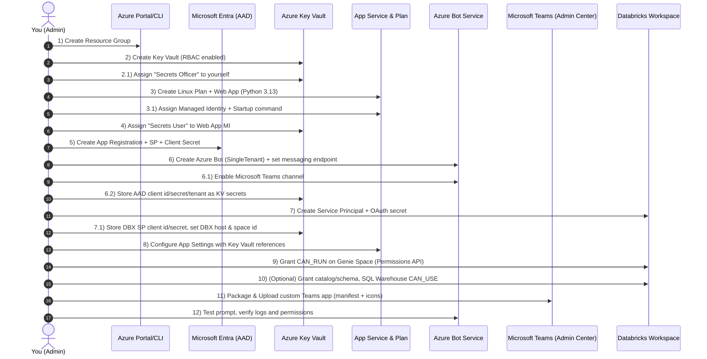

# Manual Setup Guide — Databricks Genie for Microsoft 365 (No Terraform)

> This document reproduces, **by hand**, everything the Terraform project automates. It covers **Azure** (App Service, Bot Service, Key Vault, RBAC, AAD app) and **Databricks** (Service Principal, OAuth secret, permissions on Genie Space, optional catalog/schema + SQL Warehouse). Steps include both **Portal (UI)** and **CLI** options where practical.


## Step-by-step (User Actions)

> These is a **process** diagram. Use it during runbooks.



---

## 0) Prerequisites

- Azure subscription with **Owner** or equivalent rights to create RG, KV, Web App, Bot Service, and AAD apps.
- Databricks **Workspace Admin** (or sufficient rights to create Service Principals and manage permissions).
- Tools (optional but recommended):  
  - **Azure CLI** (`az`) logged in: `az login` and `az account set --subscription "<SUB_ID>"`  
  - **cURL** and **jq** (for REST examples)  
  - **Bot Framework Emulator** (local testing, optional)

> Replace all placeholders like `<SUB_ID>`, `<RG>`, `<LOCATION>`, `<APP_NAME>`, `<BOT_NAME>`, `<KV>`, `<DBX_HOST>`, `<SPACE_ID>`, `<DBX_SP_APPID>`, etc.

---

## 1) Azure Resource Group

**Portal:** Azure Portal → Resource groups → Create → Name `<RG>` in `<LOCATION>`.

**CLI:**
```bash
az group create -n <RG> -l <LOCATION>
```

---

## 2) Azure Key Vault (RBAC mode)

**Portal:** Key Vaults → Create → Name `<KV>` in `<RG>` / `<LOCATION>` → **Enable RBAC authorization**.

**CLI:**
```bash
az keyvault create -n <KV> -g <RG> -l <LOCATION> \
  --enable-rbac-authorization true \
  --public-network-access Enabled
```

### 2.1 Grant RBAC to yourself (to write secrets)

**Portal:** Key Vault → Access control (IAM) → Add role assignment → **Key Vault Secrets Officer** → your user.

**CLI:**
```bash
KV_ID=$(az keyvault show -n <KV> -g <RG> --query id -o tsv)
ME_OID=$(az ad signed-in-user show --query id -o tsv)
az role assignment create --assignee $ME_OID --role "Key Vault Secrets Officer" --scope $KV_ID
```

---

## 3) App Service Plan (Linux) + Web App (Python 3.13)

**Portal:**  
- App Service plans → Create → Linux → SKU (e.g., **B1**) → Name `<ASP>`.  
- App Services → Create → Runtime stack **Python 3.13** → Region `<LOCATION>` → Plan `<ASP>` → Name `<APP_NAME>`.

**CLI:**
```bash
# plan
az appservice plan create -g <RG> -n <ASP> --is-linux --sku B1

# web app
az webapp create -g <RG> -p <ASP> -n <APP_NAME> --runtime "PYTHON|3.13"

# assign system-managed identity
az webapp identity assign -g <RG> -n <APP_NAME>

# set startup command (aiohttp entrypoint, same used by Terraform)
az webapp config set -g <RG> -n <APP_NAME> \
  --startup-file "python3 -m aiohttp.web -H 0.0.0.0 -P 8000 src.main:create_app"
```

> After deployment, your **bot messaging endpoint** will be:  
> `https://<APP_NAME>.azurewebsites.net/api/messages` (or use the actual default hostname returned by Azure).

---

## 4) Azure AD Application (App Registration) + Service Principal + Client Secret

**Portal:** Microsoft Entra ID → App registrations → **New registration**  
- Name: `Genie M365 App` (or your choice)  
- Supported account types: **Single tenant**  
- After create, copy **Application (client) ID** and **Directory (tenant) ID**.  
- **Certificates & secrets** → New client secret → copy the **secret value**.

**CLI:**
```bash
# create app registration (single-tenant)
APP_ID=$(az ad app create --display-name "Genie M365 App" \
    --sign-in-audience AzureADMyOrg --query appId -o tsv)

# create service principal for the app
az ad sp create --id $APP_ID

# create client secret (copy value!)
SECRET=$(az ad app credential reset --id $APP_ID --display-name "manual-setup" --query password -o tsv)
TENANT_ID=$(az account show --query tenantId -o tsv)

echo "Client ID: $APP_ID"
echo "Client Secret: $SECRET"
echo "Tenant ID: $TENANT_ID"
```

> Optional: set yourself as **Owner** of the app (Portal: App → Owners).

---

## 5) Azure Bot Service (single-tenant) + Teams channel

**Portal:** Create a **Bot Channels Registration** (Azure Bot) in `<RG>` / `<LOCATION>`  
- **Microsoft App ID** = `<APP_ID>` from step 4  
- **Type** = SingleTenant  
- **Messaging endpoint** = `https://<APP_NAME>.azurewebsites.net/api/messages`  
- After create: **Channels** → **Microsoft Teams** → **Enable**.

**CLI (requires botservice extension):**
```bash
az extension add --name botservice

az bot create --kind webapp \
  --appid $APP_ID \
  --password "$SECRET" \
  --name <BOT_NAME> \
  --resource-group <RG> \
  --location <LOCATION> \
  --endpoint "https://<APP_NAME>.azurewebsites.net/api/messages" \
  --sku F0 \
  --description "Databricks Genie bot for Microsoft 365"

# Enable Teams channel
az bot msteams create --name <BOT_NAME> --resource-group <RG>
```

---

## 6) Store base secrets in Key Vault

**Portal:** Key Vault → Secrets → Generate/Import

Create the following secrets (names match the Terraform project):
- `svc-conn-clientid` = `<APP_ID>`  
- `svc-conn-clientsecret` = `<SECRET>`  
- `svc-conn-tenantid` = `<TENANT_ID>`  
- `databricks-host` = `<DBX_HOST>` (e.g., `https://adb-123456789012345.7.azuredatabricks.net`)  
- `databricks-space-id` = `<SPACE_ID>` (your Genie space id)  
*(The next two will be available after step 7 in Databricks)*  
- `databricks-sp-client-id` = `<DBX_SP_APPID>` (GUID)  
- `databricks-sp-client-secret` = `<DBX_SP_SECRET>` (value)  

> (Optional) Also store a bootstrap PAT used for infra/scripts: `databricks-token` = `<DBX_PAT>`.

**CLI:**
```bash
az keyvault secret set --vault-name <KV> --name svc-conn-clientid     --value "$APP_ID"
az keyvault secret set --vault-name <KV> --name svc-conn-clientsecret --value "$SECRET"
az keyvault secret set --vault-name <KV> --name svc-conn-tenantid     --value "$TENANT_ID"
az keyvault secret set --vault-name <KV> --name databricks-host        --value "<DBX_HOST>"
az keyvault secret set --vault-name <KV> --name databricks-space-id    --value "<SPACE_ID>"
# after step 7:
# az keyvault secret set --vault-name <KV> --name databricks-sp-client-id     --value "<DBX_SP_APPID>"
# az keyvault secret set --vault-name <KV> --name databricks-sp-client-secret --value "<DBX_SP_SECRET>"
```

---

## 7) Databricks — Service Principal + OAuth Secret

**UI (Workspace):**  
- **Settings → User management → Service principals → Add service principal**  
  - Display name: `Genie M365 Integration` (or similar)  
  - Enable: **Workspace access** and **Databricks SQL access**  
- Open the created Service Principal → **Secrets** → **Create secret** → copy the **secret** value.  
- Capture:  
  - **Application ID (client id)** = `<DBX_SP_APPID>` (GUID)  
  - **Secret value** = `<DBX_SP_SECRET>`

**REST (alternative):**
```bash
# Create SP (SCIM 2.0 — endpoint may vary by workspace/account scope)
curl -X POST "$DBX_HOST/api/2.0/preview/scim/v2/ServicePrincipals" \
  -H "Authorization: Bearer $DBX_PAT" -H "Content-Type: application/json" \
  -d '{"displayName":"Genie M365 Integration","active":true,
       "entitlements":[{"value":"workspace-access"},{"value":"databricks-sql-access"}] }'

# Create OAuth secret for SP (endpoint may vary by version)
# Example (workspace): /api/2.0/oauth-service-principal-secrets/{application_id}
curl -X POST "$DBX_HOST/api/2.0/oauth-service-principal-secrets/$DBX_SP_APPID" \
  -H "Authorization: Bearer $DBX_PAT" -H "Content-Type: application/json" \
  -d '{"comment":"manual-setup"}'
```

**Back to Key Vault:** store `databricks-sp-client-id` and `databricks-sp-client-secret` from above (see step 6).

---

## 8) Web App → Key Vault references (App Settings)

Grant Web App’s **Managed Identity** read access to KV:

**Portal:** Key Vault → Access control (IAM) → Add role assignment → **Key Vault Secrets User** → assign to `<APP_NAME>` managed identity.

**CLI:**
```bash
WEBAPP_MI=$(az webapp identity show -g <RG> -n <APP_NAME> --query principalId -o tsv)
KV_ID=$(az keyvault show -n <KV> -g <RG> --query id -o tsv)
az role assignment create --assignee $WEBAPP_MI --role "Key Vault Secrets User" --scope $KV_ID
```

Add the following **App Settings** to the Web App (note the **Key Vault reference** syntax):

**CLI:**
```bash
# Build your Key Vault base URI (replace with your vault name)
KV_URI="https://<KV>.vault.azure.net"

az webapp config appsettings set -g <RG> -n <APP_NAME> --settings \
  CONNECTIONS__SERVICE_CONNECTION__SETTINGS__CLIENTID="@Microsoft.KeyVault(SecretUri=$KV_URI/secrets/svc-conn-clientid)" \
  CONNECTIONS__SERVICE_CONNECTION__SETTINGS__CLIENTSECRET="@Microsoft.KeyVault(SecretUri=$KV_URI/secrets/svc-conn-clientsecret)" \
  CONNECTIONS__SERVICE_CONNECTION__SETTINGS__TENANTID="@Microsoft.KeyVault(SecretUri=$KV_URI/secrets/svc-conn-tenantid)" \
  DATABRICKS_SPACE_ID="@Microsoft.KeyVault(SecretUri=$KV_URI/secrets/databricks-space-id)" \
  DATABRICKS_HOST="@Microsoft.KeyVault(SecretUri=$KV_URI/secrets/databricks-host)" \
  DATABRICKS_CLIENT_ID="@Microsoft.KeyVault(SecretUri=$KV_URI/secrets/databricks-sp-client-id)" \
  DATABRICKS_CLIENT_SECRET="@Microsoft.KeyVault(SecretUri=$KV_URI/secrets/databricks-sp-client-secret)" \
  DATABRICKS_OAUTH_SCOPES="all-apis sql offline_access"
```

> After saving, App Service resolves references using its managed identity.

---

## 9) Databricks — Grant **CAN_RUN** on Genie Space (required)

Use a Databricks **PAT** with permissions to manage space ACLs. The workspace API path used by the Terraform project is:

- **GET** `/api/2.0/permissions/genie/<SPACE_ID>` — read current ACL
- **PATCH** `/api/2.0/permissions/genie/<SPACE_ID>` — add ACEs

Grant `CAN_RUN` to your service principal (identified by its **application ID**).

**Example (idempotent) using bash/curl):**
```bash
DBX_HOST="https://<your-workspace-host>"
DBX_PAT="<your-pat>"
SPACE_ID="<your-space-id>"
DBX_SP_APPID="<service-principal-application-id>"

# Read current ACLs (ignore 404)
curl -fsS -X GET "$DBX_HOST/api/2.0/permissions/genie/$SPACE_ID" \
  -H "Authorization: Bearer $DBX_PAT" -H "Content-Type: application/json" || true

# Patch to add CAN_RUN
curl -sS -X PATCH "$DBX_HOST/api/2.0/permissions/genie/$SPACE_ID" \
  -H "Authorization: Bearer $DBX_PAT" -H "Content-Type: application/json" \
  -d '{"access_control_list":[{"service_principal_name":"'"$DBX_SP_APPID"'","permission_level":"CAN_RUN"}]}'
```

---

## 10) (Optional) Databricks — Catalog/Schema grants

**UI:** Data → Catalogs → `<CATALOG>` → Permissions → grant to principal **service-principal `<DBX_SP_APPID>`**:  
- `USE_CATALOG` on catalog  
- `USE_SCHEMA`, `SELECT`, `EXECUTE`, `READ_VOLUME` on `<CATALOG>.<SCHEMA>`

**SQL (example):**
```sql
-- As a user with privileges to administer the catalog/schema:
GRANT USE CATALOG ON CATALOG <CATALOG> TO `service-principal://<DBX_SP_APPID>`;
GRANT USE SCHEMA, SELECT, EXECUTE, READ_VOLUME ON SCHEMA <CATALOG>.<SCHEMA>
  TO `service-principal://<DBX_SP_APPID>`;
```

---

## 11) (Optional) Databricks — SQL Warehouse permission

**UI:** SQL Warehouses → select `<WAREHOUSE_ID>` → Permissions → Add principal (service principal) → **Can Use**.

**REST (example):**
```bash
curl -sS -X PATCH "$DBX_HOST/api/2.0/permissions/sql/warehouses/<WAREHOUSE_ID>" \
  -H "Authorization: Bearer $DBX_PAT" -H "Content-Type: application/json" \
  -d '{"access_control_list":[{"service_principal_name":"'"$DBX_SP_APPID"'","permission_level":"CAN_USE"}]}'
```

---

## 12) Teams App package (upload custom app)

Create a Teams app package (ZIP) with your **manifest.json** and icons (**color** 192×192, **outline** 32×32). The Terraform project templates (`ms_teams_manifest.tftpl`) can be adapted:

- Update **botId** with `<APP_ID>` and endpoint to your Web App.  
- Zip `manifest.json` + the two icon files.

**Upload:** Teams → Apps → **Upload a custom app** (or Teams Admin Center for org-wide deployment).

---

## 13) Smoke test

- Open the bot in Teams and send a prompt.
- Check App Service logs: **Log stream** in Portal, or `az webapp log tail -g <RG> -n <APP_NAME>`.
- If needed, test locally via Bot Framework Emulator against the `/api/messages` endpoint.

---

## 14) Troubleshooting tips

- **401/403** from Databricks: confirm Genie Space **CAN_RUN**, and that OAuth client ID/secret for the Databricks SP are correct in KV.
- **Key Vault reference not resolving**: ensure Web App **Managed Identity** has **Key Vault Secrets User** on your vault and that app settings use the exact `@Microsoft.KeyVault(SecretUri=...)` form.
- **Bot not responding in Teams**: verify Bot Service **Messaging endpoint** is reachable (no auth errors), and the Teams channel is **Enabled**.

---

## ✅ Summary of Created Objects (Manual)

- **Azure**: Resource Group, App Service Plan (Linux), App Service (Python 3.13, Managed Identity), Key Vault (RBAC), RBAC roles (Secrets Officer to you, Secrets User to Web App MI), Azure AD App + SP + Secret, Azure Bot (single-tenant) + Teams channel.
- **Key Vault Secrets**: `svc-conn-clientid`, `svc-conn-clientsecret`, `svc-conn-tenantid`, `databricks-host`, `databricks-space-id`, `databricks-sp-client-id`, `databricks-sp-client-secret`, `(optional) databricks-token`.
- **Databricks**: Workspace Service Principal + OAuth secret; Genie Space **CAN_RUN** grant; (optional) Catalog/Schema grants; (optional) SQL Warehouse **CAN_USE**.
- **Teams**: Custom app package uploaded referencing your bot/app ID and web endpoint.

---

**End of document.**


## Step-by-step GIFs (placeholders)

1. **Create Resource Group & Plan**  
   

2. **Create Web App (Python) + enable Managed Identity**  
   

3. **Create Key Vault & grant MI**  
   

4. **Create App Registration (if applicable)**  
   

5. **Databricks SP & UC permissions**  
   

6. **Create Azure Bot & connect endpoint**  
   

7. **Deploy code to Web App**  
   

8. **Upload Teams package**  
   
